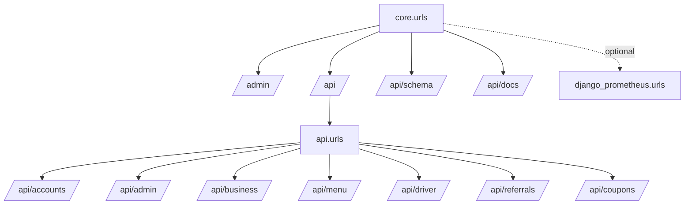
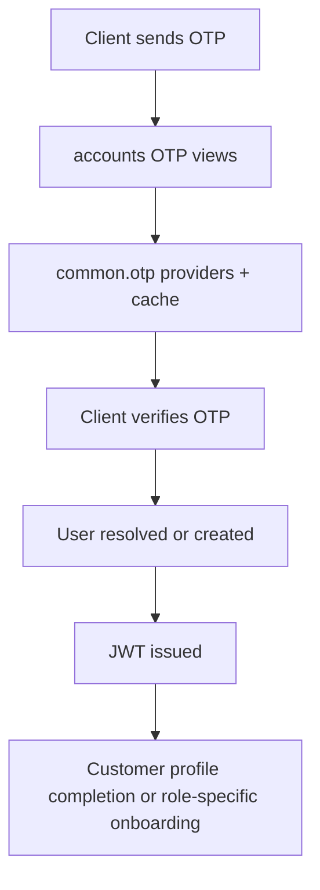
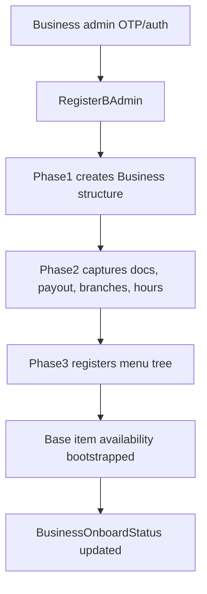
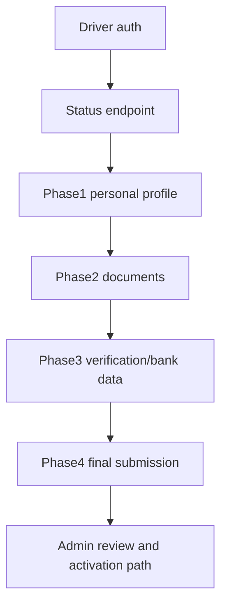
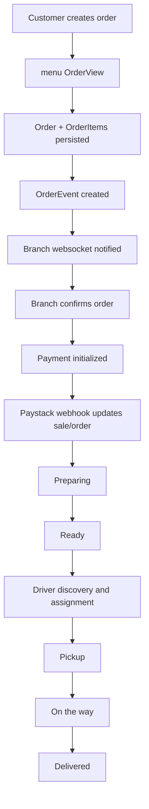
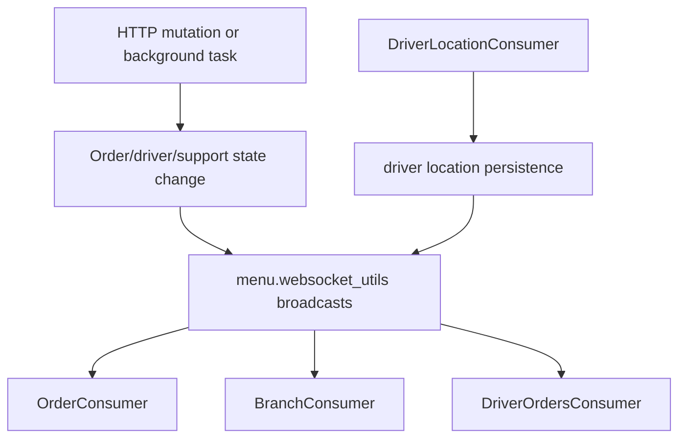
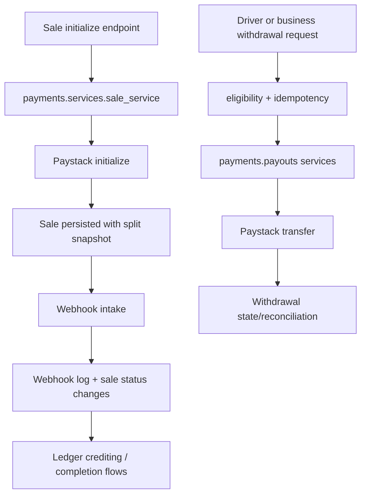

# Ovena Backend Architecture Blueprint

Generated: 2026-05-09
Scope: `C:\Users\paika\Documents\programs\python\backend\ovena-backend`
Type: current-state architecture map derived from code

## 1. Purpose

This document captures how the backend is wired today:

1. Runtime platform and infrastructure dependencies.
2. Installed apps and domain ownership.
3. Active HTTP and WebSocket surfaces.
4. Major data relationships and cross-app dependencies.
5. End-to-end operational flows.
6. Current gaps, risks, and architectural drift visible in code.

This is a documentation update only. No application behavior is changed by this file.

## 2. System Summary

Ovena is a Django-based delivery backend for a multi-sided food ordering platform. The codebase currently supports:

- Customer authentication and ordering.
- Business onboarding and post-onboarding operations.
- Driver onboarding, availability, payouts, and performance views.
- Real-time order and location updates over WebSockets.
- Payment initialization, webhook intake, wallet and withdrawal flows.
- Coupon, referral, notification, and support workflows.
- Admin operational tooling for users, businesses, drivers, withdrawals, support, and referral payouts.

Architecturally, the backend is a modular Django monolith with:

- HTTP APIs exposed through Django REST Framework.
- Realtime features exposed through Channels.
- Asynchronous work handled by Celery.
- PostGIS-backed relational persistence.
- Redis-backed cache, broker, result backend, and channel layer.

## 3. Runtime Platform

## 3.1 Core stack

- Python `>=3.14` in `pyproject.toml`
- Django `5.1`
- Django REST Framework
- SimpleJWT
- Django Channels + Daphne
- Celery
- PostgreSQL/PostGIS
- Redis

## 3.2 Operational integrations

- Cloudflare R2 / S3-compatible object storage for public and private media
- Paystack for payment initialization, transfers, and webhook processing
- Termii for SMS OTP
- Amazon SES via Anymail for email delivery
- Google OAuth exchange support
- OpenRouteService, Mapbox, and Google routing backends
- Optional Prometheus metrics when `ENABLE_METRICS=True`

## 3.3 Process model

- `core.wsgi` for WSGI hosting
- `core.asgi` for HTTP + WebSocket hosting
- `core.celery` for background workers
- `entrypoint.sh` and Docker assets for containerized deployment

## 4. Installed Apps and Ownership

| App                | Role                                                         | Current status          |
| ------------------ | ------------------------------------------------------------ | ----------------------- |
| `accounts`         | Identity, roles, onboarding, business hierarchy, driver KYC  | Live                    |
| `addresses`        | Address storage, GIS helpers, driver location support        | Live utility/data layer |
| `business_api`     | Authenticated business admin control surface                 | Live                    |
| `menu`             | Catalog, menu structure, order lifecycle, chat, WebSockets   | Live                    |
| `driver_api`       | Driver dashboard, availability, earnings, withdrawals        | Live                    |
| `notifications`    | Notification persistence and role-specific notification APIs | Live                    |
| `authflow`         | Shared auth, permissions, schema helpers, abstract models    | Live utility layer      |
| `ratings`          | Order, driver, and branch rating APIs/models                 | Installed but unmounted |
| `coupons_discount` | Coupons and coupon wheel                                     | Live                    |
| `referrals`        | Referral relationships and referral payouts                  | Live                    |
| `payments`         | Sales, ledger, idempotency, withdrawals, reconciliation      | Live                    |
| `support_center`   | Driver, business, and admin support ticket APIs              | Live                    |
| `admin_api`        | Internal operational and finance admin APIs                  | Live                    |

## 4.1 Code-present but not part of the active app graph

| Module         | Notes                                                                                            |
| -------------- | ------------------------------------------------------------------------------------------------ |
| `verification` | Has views/services/serializers, but is not in `INSTALLED_APPS` and is not mounted                |
| `image`        | Utility view module used by onboarding/business image endpoints, but not an installed Django app |
| `api`          | URL/index/routing entrypoint, not a domain app                                                   |

## 5. Root Routing Graph

## 5.1 HTTP mount graph

## 5.2 WebSocket mount graph

`core.asgi` mounts `api.routing.websocket_urlpatterns` under Channels:

- `/ws/orders/<order_id>/`
- `/ws/driver/location/`
- `/ws/branch/`
- `/ws/driver/orders/`
- `/ws/orders/<order_id>/chat/`

These are wrapped with:

- `AllowedHostsOriginValidator`
- `menu.ws_middleware.TokenAuthMiddleware`

## 6. Route Surface by Domain

This section summarizes the API surface by bounded area instead of listing every single method.

## 6.1 Public/platform routes

- `GET /`
- `GET /api/schema/`
- `GET /api/docs/`
- `admin/`

## 6.2 Accounts

Mounted at `/api/accounts/`

- OTP send/verify for phone and email
- Customer registration and profile fetch/update
- OAuth exchange
- JWT login, refresh, rotation, logout
- Password reset and password change
- Business onboarding:
  - `/api/accounts/onboard/admin/`
  - `/api/accounts/onboard/re/admin/`
  - `/api/accounts/onboard/phase1/`
  - `/api/accounts/onboard/phase2/`
  - `/api/accounts/onboard/phase3/`
  - `/api/accounts/onboard/batch-gen-url/`
  - `/api/accounts/onboard/status/`
- Driver onboarding:
  - `/api/accounts/onboard/driver/status/`
  - `/api/accounts/onboard/driver/phase/1/` through `/phase/4/`
- Linked-user and app-admin approval/request flows

## 6.3 Business API

Mounted at `/api/business/`

- Business dashboard and store analysis
- Business payout setup and payment verification
- Business wallet balance, transaction history, withdrawal eligibility, withdrawal request/history
- Branch list, branch edit, branch delete
- Branch hours and branch closure routes
- Close-all-branches route
- Staff list and revoke routes
- Business admin update and verification
- Business image update
- Business notifications and support ticket routes included from other apps

## 6.4 Menu and ordering

Mounted at `/api/menu/`

- Business menu listing
- Restaurant list and homepage feeds
- Menu-item search
- Customer order create/detail/cancel
- Restaurant order interactions
- Driver order interactions
- Menu update and delete surfaces for business users
- Branch-scoped availability list and bulk update routes

## 6.5 Driver API

Mounted at `/api/driver/`

- Driver dashboard
- Driver profile
- Driver availability
- Earnings summary/history
- Withdrawal eligibility, create/list, detail
- Performance analytics
- Driver notifications
- Driver support FAQs and support tickets

## 6.6 Admin API

Mounted at `/api/admin/`

- Admin login/profile/update
- Dashboard stats
- User list/detail
- Driver list and onboarding review
- Business list and update
- Withdrawal list/detail/retry/mark-paid/mark-failed/batch-execute/reconcile
- Notification list/send
- Password reset/change/token refresh/logout
- Coupon and coupon-wheel management
- Admin support tickets
- Referral payout admin APIs

## 6.7 Payments

Mounted directly from `payments.urls` under `/api/`

- `POST /api/sales/initialize/`
- `POST /api/sales/<uuid:sale_id>/complete/`
- `POST /api/sales/<uuid:sale_id>/refund/`
- `GET /api/wallet/balance/`
- `POST /api/wallet/withdraw/`
- `GET /api/wallet/withdrawals/`
- `POST /api/webhooks/paystack/`

## 6.8 Promotions and referrals

- `/api/coupons/eligible/`
- `/api/coupons/wheel/`
- `/api/coupons/wheel/spin/`
- `/api/referrals/apply/`
- `/api/referrals/me/status/`
- `/api/referrals/me/list/`

## 6.9 Dormant routes

`ratings.urls` exists but is not mounted from `api.urls`:

- `/rate-order/`
- `/driver-ratings/`
- `/branch-ratings/`

Status: code-present, installed, unreachable from the root URL graph.

## 7. Data Ownership and Key Models

## 7.1 Identity and business structure

Owned by `accounts`

- `User`
- `ProfileBase`
- `CustomerProfile`
- `DriverProfile`
- `BusinessAdmin`
- `PrimaryAgent`
- `Business`
- `Branch`
- `BranchOperatingHours`
- `BusinessOnboardStatus`
- `BusinessCerd`
- `BusinessPayoutAccount`
- `DriverCred`
- `DriverAvailability`
- `DriverOnboardingSubmission`
- `DriverDocument`
- `DriverVerification`
- `DriverBankAccount`

## 7.2 Catalog and orders

Owned by `menu`

- `BaseItem`
- `Menu`
- `MenuCategory`
- `MenuItem`
- `VariantGroup`
- `VariantOption`
- `MenuItemAddonGroup`
- `MenuItemAddon`
- `BaseItemAvailability`
- `Order`
- `OrderItem`
- `OrderEvent`
- `ChatMessage`

Current `Order.STATUS_CHOICES`:

- `pending`
- `confirmed`
- `payment_pending`
- `preparing`
- `ready`
- `driver_assigned`
- `picked_up`
- `on_the_way`
- `delivered`
- `cancelled`

## 7.3 Payments and ledger

Owned by `payments`

- `UserAccount`
- `PlatformConfig`
- `PaymentIdempotencyKey`
- `Sale`
- `LedgerEntry`
- `Withdrawal`
- `PaystackWebhookLog`
- `ReconciliationLog`

## 7.4 Driver operations

Owned by `driver_api`

- `DriverWallet`
- `DriverLedgerEntry`
- `DriverWithdrawalRequest`
- `SupportFAQCategory`
- `SupportFAQItem`

## 7.5 Support

Owned by `support_center`

- `SupportTicket`
- `SupportTicketMessage`

## 7.6 Promotions and trust

- `coupons_discount`: `Coupons`, `CouponWheel`
- `ratings`: `DriverRating`, `BranchRating`
- `referrals`: `ProfileReferral`, `ReferralPayout`
- `notifications`: `Notification`

## 8. Cross-App Dependency Map

| From             | Depends on                                                         | Why                                                                          |
| ---------------- | ------------------------------------------------------------------ | ---------------------------------------------------------------------------- |
| `menu`           | `accounts`, `coupons_discount`, `payments`                         | orders depend on customer/branch/driver, coupon FK, and `Sale` linkage       |
| `business_api`   | `accounts`, `payments`, `notifications`, `support_center`, `image` | business admin operations, payout flows, support and notifications           |
| `driver_api`     | `accounts`, `payments`, `notifications`, `support_center`          | driver identity, payout state, notifications, support                        |
| `payments`       | `accounts`, `menu`, `referrals`, `driver_api`                      | sale parties, order linkage, referral allocation, driver withdrawal bridging |
| `referrals`      | `accounts`                                                         | profile and user linkage                                                     |
| `ratings`        | `accounts`, `menu`, `authflow`                                     | customer/driver/branch/order and auth helpers                                |
| `support_center` | `accounts`                                                         | ticket ownership and assignee relationships                                  |
| `notifications`  | `accounts`                                                         | target user relationships                                                    |
| `addresses`      | `accounts`                                                         | driver location and GIS helpers                                              |

## 9. Major Runtime Flows

## 9.1 Authentication and account bootstrap

## 9.2 Business onboarding

## 9.3 Driver onboarding

## 9.4 Customer order lifecycle

## 9.5 Realtime updates

## 9.6 Payment and payout flow

## 10. Architecture Strengths

- Clear app-level separation between identity, ordering, payments, business ops, and driver ops.
- Payments app has a strong accounting-centric model with idempotency and reconciliation concepts.
- WebSocket paths are explicit and centered around order and driver coordination.
- Business and driver APIs are separated from onboarding, which keeps post-onboarding operational surfaces cleaner.
- Support and notifications are reusable surfaces mounted into role-specific APIs.

## 11. Current Risks and Design Drift

| Severity | Area                       | Finding                                                                                                                                                                                        | Evidence                                               |
| -------- | -------------------------- | ---------------------------------------------------------------------------------------------------------------------------------------------------------------------------------------------- | ------------------------------------------------------ |
| High     | Access control consistency | The project relies heavily on per-view configuration and custom auth classes, while DRF default permission classes are not globally locked down. Mutating routes must be audited individually. | `core/settings.py`, multiple view modules              |
| High     | Documentation drift        | The previous blueprint no longer matched mounted apps: referrals are live, payments/admin/business/driver routes exist, and the WebSocket branch route changed to `/ws/branch/`.               | `api/urls.py`, `api/routing.py`                        |
| Medium   | Dormant installed app      | `ratings` is installed but not mounted, which increases maintenance cost and creates misleading expectations about available APIs.                                                             | `core/settings.py`, `ratings/urls.py`, `api/urls.py`   |
| Medium   | Naming drift               | The code still mixes `business` and `restaurant` terminology and contains misspellings like `Buisness...`, making mental models and API naming inconsistent.                                   | `accounts`, `business_api`, `menu`                     |
| Medium   | Support model split        | FAQ data lives in `driver_api`, while tickets live in `support_center` and are mounted through multiple apps. Ownership is workable but conceptually split.                                    | `driver_api/models.py`, `support_center/models.py`     |
| Medium   | Utility/module drift       | `verification` exists outside the active app graph, and `image.views` is used as a utility module rather than a proper installed app.                                                          | repo structure, mounted URLs                           |
| Medium   | Payment coupling           | `menu.Order` directly references `payments.Sale`, while driver withdrawals bridge into `payments.Withdrawal`. This is practical, but creates tight cross-app coupling.                         | `menu/models/order.py`, `driver_api/unified_bridge.py` |
| Medium   | Worktree hygiene           | The repository already has unrelated modified/untracked files, so documentation changes should be reviewed alongside existing local work.                                                      | `git status --short`                                   |

## 12. Recommended Backlog

1. Decide whether `ratings` should be mounted, removed, or moved behind a feature flag.
2. Add an architecture test that asserts the mounted URL graph for installed route-bearing apps.
3. Introduce explicit default permission classes or a permission audit for every mutating endpoint.
4. Normalize naming from `restaurant`/`buisness` toward one canonical vocabulary.
5. Consolidate support ownership so FAQ and ticketing live under one clear domain.
6. Decide whether `verification` should become an installed app or be removed.
7. Consider documenting route contracts from code generation instead of maintaining them manually.
8. Reduce cross-app leakage by formalizing service boundaries between `menu`, `payments`, and `driver_api`.

## 13. Validation Sources

Primary files used for this blueprint:

- `core/settings.py`
- `core/urls.py`
- `core/asgi.py`
- `api/urls.py`
- `api/routing.py`
- `accounts/urls.py`
- `business_api/urls.py`
- `menu/urls.py`
- `driver_api/urls.py`
- `admin_api/urls.py`
- `payments/urls.py`
- `coupons_discount/urls.py`
- `referrals/urls.py`
- `ratings/urls.py`
- model and README files across the mounted apps

## 14. Assumptions

1. This is a current-state map, not a target-state proposal.
2. Route summaries prioritize mounted behavior over dormant code.
3. Live status means reachable from the root URL or ASGI graph.
4. Some behavioral details still require runtime validation with environment variables and external services configured.
