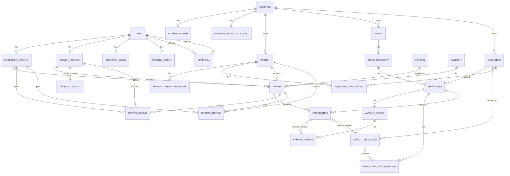
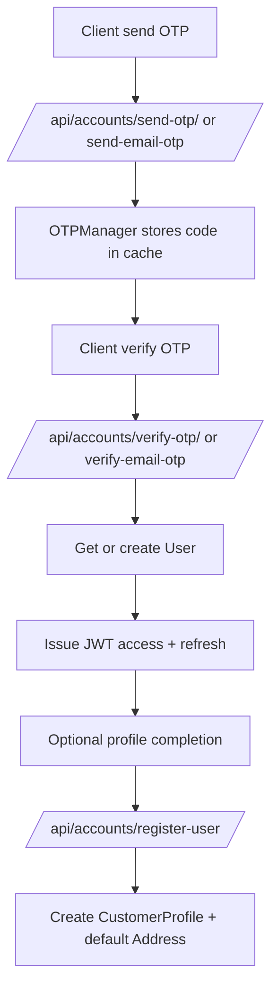
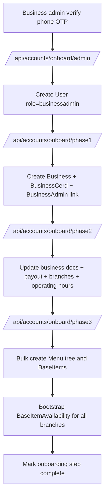
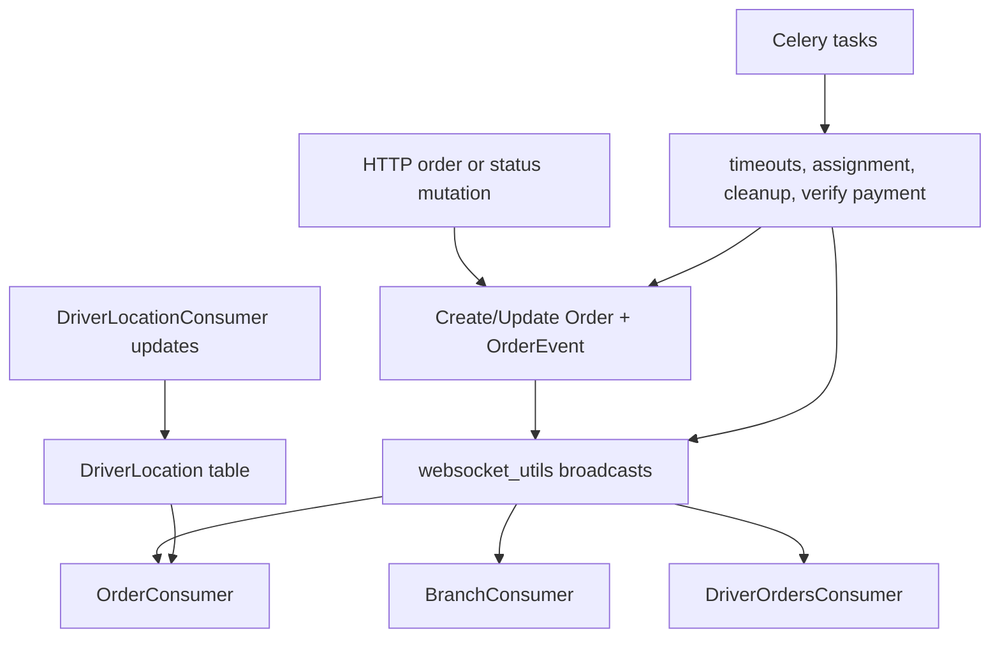

# Ovena Backend Current-State Architecture Blueprint

Generated: 2026-02-28  
Scope: `C:/Users/paika/Documents/new_programs/python/backend_work/ovena-backend`

## 1. Summary

This blueprint captures the backend as it currently exists, including:

1. All systems in code (live and dormant).
2. Model relationships across apps.
3. Full HTTP + WebSocket route map with reachability status.
4. Operational flows (auth, onboarding, order lifecycle, payment, dispatch, realtime).
5. Wiring gaps and risks.

This is a read-only architecture map. No API behavior was changed.

## 2. Source of Truth

- `core/settings.py`
- `core/urls.py`
- `api/urls.py`
- `api/routing.py`
- `accounts/urls.py`
- `menu/urls.py`
- `coupons_discount/urls.py`
- `ratings/urls.py`
- `referrals/urls.py`

## 3. Runtime and Platform Systems

- Django + DRF
- `rest_framework_simplejwt`
- Channels + Daphne + Redis channel layer
- Celery + Redis broker/result
- PostGIS database backend
- S3-backed media storage (public + private buckets)
- Paystack integration (payment init + webhook)
- Mono integration (driver identity verification)
- Termii integration (SMS OTP)
- SES via Anymail (email OTP)

## 4. Domain Systems Inventory

| App | Purpose | Status |
|---|---|---|
| `accounts` | Users, roles, customer/driver/business admin/staff, onboarding | Live |
| `addresses` | Address point storage + driver live location | Live (model/service level) |
| `menu` | Menu catalog, availability, orders, events, chat, dispatch | Live |
| `coupons_discount` | Coupon rules + coupon wheel admin and spin | Live |
| `ratings` | Driver/branch ratings + stats signals | Dormant (app installed, routes not mounted from root) |
| `referrals` | Referral ledger and conversion state | Broken + Dormant (recursive `urls.py`, not mounted from root) |
| `authflow` | Auth helpers/decorators/permissions/schemas | Live utility layer, placeholder models/views |

## 5. URL Mount Graph and Reachability

```mermaid
flowchart TD
    A[core.urls] --> B[/admin/]
    A --> C[/api/]
    A --> D[/api/schema/]
    A --> E[/api/docs/]
    A --> F[/]

    C --> G[api.urls]
    G --> H[/api/accounts/ -> accounts.urls]
    G --> I[/api/menu/ -> menu.urls]
    G --> J[/api/ -> coupons_discount.urls]

    A -. not mounted .-> K[ratings.urls]
    A -. not mounted .-> L[referrals.urls]
    L -. recursive include .-> L
```

Reachability states used:

- `live`: reachable from `core.urls`.
- `dormant`: route file exists but not mounted from `core.urls`.
- `broken`: routing definition is recursive or misconfigured.

## 6. Canonical Route Inventory

### 6.1 Live HTTP Routes

| protocol | method | path | mounted_prefix | view | auth_class | permission | state |
|---|---|---|---|---|---|---|---|
| HTTP | GET | `/` | `/` | `api.views.index` | Django view | Public | live |
| HTTP | GET | `/api/schema/` | `/` | `SpectacularAPIView` | Public | Public | live |
| HTTP | GET | `/api/docs/` | `/` | `SpectacularSwaggerView` | Public | Public | live |
| HTTP | GET,POST | `/admin/` | `/` | Django admin site | Session/admin auth | Admin site perms | live |
| HTTP | POST | `/api/accounts/send-otp/` | `/api/accounts/` | `accounts.views.otp_views.SendPhoneOTPView` | `JWTAuthentication` (global default) | `AllowAny` (default) | live |
| HTTP | POST | `/api/accounts/verify-otp/` | `/api/accounts/` | `accounts.views.otp_views.VerifyOTPView` | `JWTAuthentication` (global default) | `AllowAny` (default) | live |
| HTTP | POST | `/api/accounts/register-manager/` | `/api/accounts/` | `accounts.views.account_views.RegisterRManager` | `JWTAuthentication` (global default) | none (`[]`) | live |
| HTTP | POST | `/api/accounts/register-user/` | `/api/accounts/` | `accounts.views.account_views.RegisterCustomer` | `CustomCustomerAuth` | `IsAuthenticated` | live |
| HTTP | POST | `/api/accounts/oauth/exchange/` | `/api/accounts/` | `accounts.views.oath_views.OAuthExchangeView` | `JWTAuthentication` (global default) | `AllowAny` | live |
| HTTP | GET | `/api/accounts/profile/` | `/api/accounts/` | `accounts.views.account_views.UserProfileView` | `JWTAuthentication` (global default) | `IsAuthenticated` | live |
| HTTP | PUT | `/api/accounts/customer/update/` | `/api/accounts/` | `accounts.views.account_views.UpdateCustomer` | `CustomCustomerAuth` | `IsAuthenticated` | live |
| HTTP | DELETE | `/api/accounts/profile/delete/` | `/api/accounts/` | `accounts.views.account_views.DeleteAccountView` | `JWTAuthentication` (global default) | `IsAuthenticated` | live |
| HTTP | DELETE | `/api/accounts/profile/delete2/` | `/api/accounts/` | `accounts.views.account_views.Delete2AccountView` | `JWTAuthentication` (global default) | `AllowAny` (default) | live |
| HTTP | POST | `/api/accounts/send-email-otp/` | `/api/accounts/` | `accounts.views.otp_views.SendEmailOTPView` | `JWTAuthentication` (global default) | `AllowAny` (default) | live |
| HTTP | POST | `/api/accounts/verify-email-otp/` | `/api/accounts/` | `accounts.views.otp_views.VerifyEmailOTPView` | `JWTAuthentication` (global default) | `AllowAny` (default) | live |
| HTTP | PATCH | `/api/accounts/branches/{branch_id}/update/` | `/api/accounts/` | `accounts.views.account_views.UpdateBranch` | `JWTAuthentication` (global default) | `AllowAny` (default) | live |
| HTTP | POST | `/api/accounts/rotate-token/` | `/api/accounts/` | `accounts.views.jwt_views.RotateTokenView` | `JWTAuthentication` (global default) | `AllowAny` (default) | live |
| HTTP | POST | `/api/accounts/refresh/` | `/api/accounts/` | `accounts.views.jwt_views.RefreshTokenView` | `JWTAuthentication` (global default) | `AllowAny` (default) | live |
| HTTP | POST | `/api/accounts/logout/` | `/api/accounts/` | `accounts.views.jwt_views.LogoutView` | `JWTAuthentication` (global default) | `IsAuthenticated` | live |
| HTTP | POST | `/api/accounts/login/` | `/api/accounts/` | `accounts.views.jwt_views.LogInView` | `JWTAuthentication` (global default) | `AllowAny` (default) | live |
| HTTP | POST | `/api/accounts/onboard/admin/` | `/api/accounts/onboard/` | `accounts.views.account_views.RegisterBAdmin` | `JWTAuthentication` (global default) | `AllowAny` | live |
| HTTP | POST | `/api/accounts/onboard/phase1/` | `/api/accounts/onboard/` | `accounts.views.account_views.RestaurantPhase1RegisterView` | `JWTAuthentication` (global default) | `IsBusinessAdmin` | live |
| HTTP | POST | `/api/accounts/onboard/phase2/` | `/api/accounts/onboard/` | `accounts.views.account_views.RestaurantPhase2OnboardingView` | `CustomBAdminAuth` | `IsBusinessAdmin` | live |
| HTTP | POST | `/api/accounts/onboard/phase3/` | `/api/accounts/onboard/` | `menu.views.registration.RegisterMenusPhase3View` | `CustomBAdminAuth` | `IsBusinessAdmin` | live |
| HTTP | POST | `/api/accounts/onboard/batch-gen-url/` | `/api/accounts/onboard/` | `menu.views.registration.BatchGenerateUploadURLView` | `CustomBAdminAuth` | `IsBusinessAdmin` | live |
| HTTP | GET | `/api/accounts/onboard/status/` | `/api/accounts/onboard/` | `accounts.views.account_views.BuisnnessOnboardingStatusView` | `JWTAuthentication` (global default) | `IsBusinessAdmin` | live |
| HTTP | GET | `/api/accounts/onboard/driver/status/` | `/api/accounts/onboard/driver/` | `accounts.views.driver_reg_views.OnboardingStatusView` | `JWTAuthentication` (global default) | `IsAuthenticated` | live |
| HTTP | PUT | `/api/accounts/onboard/driver/phase/1/` | `/api/accounts/onboard/driver/` | `accounts.views.driver_reg_views.OnboardingPhase1View` | `JWTAuthentication` (global default) | `IsAuthenticated` | live |
| HTTP | PUT | `/api/accounts/onboard/driver/phase/2/` | `/api/accounts/onboard/driver/` | `accounts.views.driver_reg_views.OnboardingPhase2View` | `JWTAuthentication` (global default) | `IsAuthenticated` | live |
| HTTP | PUT | `/api/accounts/onboard/driver/phase/3/` | `/api/accounts/onboard/driver/` | `accounts.views.driver_reg_views.OnboardingPhase3View` | `JWTAuthentication` (global default) | `IsAuthenticated` | live |
| HTTP | PUT | `/api/accounts/onboard/driver/phase/4/` | `/api/accounts/onboard/driver/` | `accounts.views.driver_reg_views.OnboardingPhase4View` | `JWTAuthentication` (global default) | `IsAuthenticated` | live |
| HTTP | POST | `/api/accounts/admin-login/` | `/api/accounts/` | `accounts.views.account_views.AdminLoginView` | `JWTAuthentication` (global default) | `AllowAny` | live |
| HTTP | POST | `/api/accounts/driver-login/` | `/api/accounts/` | `accounts.views.account_views.DriverLoginView` | `JWTAuthentication` (global default) | `AllowAny` | live |
| HTTP | POST | `/api/accounts/password-reset/` | `/api/accounts/` | `accounts.views.account_views.PasswordResetView` | `JWTAuthentication` (global default) | `AllowAny` | live |
| HTTP | GET | `/api/menu/businesses/{business_id}/menus/` | `/api/menu/` | `menu.views.main.MenuView` | `JWTAuthentication` (global default) | `AllowAny` (default) | live |
| HTTP | GET | `/api/menu/restaurant-list/` | `/api/menu/` | `menu.views.main.RestaurantView` | `JWTAuthentication` (global default) | `AllowAny` (default) | live |
| HTTP | GET | `/api/menu/menuitem-search/` | `/api/menu/` | `menu.views.main.SearchMenuItems` | `JWTAuthentication` (global default) | `AllowAny` (default) | live |
| HTTP | GET,POST | `/api/menu/restaurant-order/` | `/api/menu/` | `menu.views.order.ResturantOrderView` | `CustomJWTAuthentication` (via decorator) | `ScopePermission` (decorator-level) | live |
| HTTP | GET,POST | `/api/menu/driver-order/` | `/api/menu/` | `menu.views.order.DriverOrderView` | `CustomDriverAuth` | `AllowAny` (default) | live |
| HTTP | GET | `/api/menu/home-page/` | `/api/menu/` | `menu.views.main.HomePageView` | `JWTAuthentication` (global default) | `AllowAny` (default) | live |
| HTTP | GET,POST | `/api/menu/order/` | `/api/menu/` | `menu.views.order.OrderView` | `CustomCustomerAuth` | `AllowAny` (default) | live |
| HTTP | GET | `/api/menu/orders/{order_id}/` | `/api/menu/` | `menu.views.order.OrderView` | `CustomCustomerAuth` | `AllowAny` (default) | live |
| HTTP | PATCH | `/api/menu/order/{order_id}/cancel/` | `/api/menu/` | `menu.views.order.OrderCancelView` | `CustomCustomerAuth` | `AllowAny` (default) | live |
| HTTP | POST (expected) | `/api/menu/paystack/webhook/` | `/api/menu/` | `menu.payment_views.paystack_webhook` | Custom HMAC signature validation | Public endpoint + signature check | live |
| HTTP | GET | `/api/coupons/eligible/` | `/api/` | `coupons_discount.views.EligibleCouponsListView` | `JWTAuthentication` (global default) | `IsAdminUser` | live |
| HTTP | GET | `/api/coupon-wheel/` | `/api/` | `coupons_discount.views.CouponWheelGetView` | `JWTAuthentication` (global default) | `IsAuthenticated` | live |
| HTTP | POST | `/api/coupon-wheel/spin/` | `/api/` | `coupons_discount.views.CouponWheelSpinView` | `JWTAuthentication` (global default) | `IsAuthenticated` | live |
| HTTP | POST | `/api/admin/coupons/` | `/api/` | `coupons_discount.views.CouponCreateView` | `JWTAuthentication` (global default) | `IsAdminUser` | live |
| HTTP | PUT,PATCH | `/api/admin/coupons/{pk}/` | `/api/` | `coupons_discount.views.CouponUpdateView` | `JWTAuthentication` (global default) | `IsAdminUser` | live |
| HTTP | POST | `/api/admin/coupon-wheels/` | `/api/` | `coupons_discount.views.CouponWheelCreateView` | `JWTAuthentication` (global default) | `IsAdminUser` | live |
| HTTP | PUT,PATCH | `/api/admin/coupon-wheels/{pk}/` | `/api/` | `coupons_discount.views.CouponWheelSetterView` | `JWTAuthentication` (global default) | `IsAdminUser` | live |

Notes:

- If `ENABLE_METRICS=True`, additional prometheus routes are included at root via `django_prometheus.urls`.
- DRF global default auth class is `rest_framework_simplejwt.authentication.JWTAuthentication`.
- DRF default permission is `AllowAny` where no explicit class is set.

### 6.2 Dormant and Broken HTTP Routes

| protocol | method | path | mounted_prefix | view | auth_class | permission | state |
|---|---|---|---|---|---|---|---|
| HTTP | POST | `rate-order/` | N/A (unmounted) | `ratings.views.SubmitOrderRatingsView` | `JWTAuthentication` (default if mounted) | `IsAuthenticated` | dormant |
| HTTP | GET | `driver-ratings/` | N/A (unmounted) | `ratings.views.DriverRatingsView` | `CustomDriverAuth` | `IsAuthenticated` | dormant |
| HTTP | GET | `branch-ratings/` | N/A (unmounted) | `ratings.views.BranchRatingsView` | `CustomJWTAuthentication` (via decorator) | `ScopePermission` (decorator-level) | dormant |
| HTTP | include | `api/referrals/` | N/A (unmounted) | `referrals.urls -> include("referrals.urls")` | N/A | N/A | broken |

Notes:

- `ratings.urls` exists but is not included from `core.urls`/`api.urls`.
- `referrals.urls` is recursively self-including and would recurse if mounted.
- `referrals.views` classes exist but are unreachable from root.

### 6.3 Live WebSocket Routes

| protocol | method | path | mounted_prefix | view | auth_class | permission | state |
|---|---|---|---|---|---|---|---|
| WS | CONNECT | `/ws/orders/{order_id}/` | `/ws/` | `menu.consumers.OrderConsumer` | token from `TokenAuthMiddleware`, validated in consumer | order participant check (customer/driver/branch) | live |
| WS | CONNECT | `/ws/driver/location/` | `/ws/` | `menu.consumers.DriverLocationConsumer` | token from `TokenAuthMiddleware`, validated in consumer | driver role check | live |
| WS | CONNECT | `/ws/branch/{branch_id}/` | `/ws/` | `menu.consumers.BranchConsumer` | token from `TokenAuthMiddleware`, validated in consumer | branch staff + branch ownership check | live |
| WS | CONNECT | `/ws/driver/orders/` | `/ws/` | `menu.consumers.DriverOrdersConsumer` | token from `TokenAuthMiddleware`, validated in consumer | driver role check | live |
| WS | CONNECT | `/ws/orders/{order_id}/chat/` | `/ws/` | `menu.consumers.ChatConsumer` | token from `TokenAuthMiddleware`, validated in consumer | order participant check | live |

## 7. Model Relationship Map

### 7.1 Aggregate Relationship View

- `User -> CustomerProfile` (`OneToOne`)
- `User -> DriverProfile` (`OneToOne`)
- `User -> BusinessAdmin` (`OneToOne`)
- `User -> PrimaryAgent` (`OneToOne` without explicit related_name)
- `Business -> Branch -> BranchOperatingHours`
- `Business -> Menu -> MenuCategory -> MenuItem`
- `BaseItem` reused by `MenuItem` and `MenuItemAddon`
- `Branch + BaseItem -> BaseItemAvailability` (unique pair)
- `Order -> OrderItem -> (VariantOption M2M, MenuItemAddon M2M)`
- `Order -> Coupon`, `Order -> DriverProfile`, `Order -> Payment`
- `DriverProfile <-> DriverLocation` (`OneToOne`)
- `DriverRating` and `BranchRating` link into `Order`, `CustomerProfile`, and `DriverProfile`/`Branch`
- `Referral` links `User(referrer) -> User(referee)`

### 7.2 ER Diagram (Key Models)



### 7.3 Cross-App Dependency Map

| From app | Depends on | Why |
|---|---|---|
| `menu` | `accounts`, `addresses`, `coupons_discount` | Orders use user/branch/driver, location lookup, coupon FK |
| `ratings` | `accounts`, `menu`, `authflow` | Rating entities depend on order/customer/driver/branch and auth decorators |
| `referrals` | `accounts` | Referral model and code application use auth user/customer profile |
| `accounts` | `authflow`, `addresses`, `menu` | token/otp utilities, address FK/M2M, driver current order FK |
| `addresses` | `accounts` | driver location OneToOne to `DriverProfile` |
| `coupons_discount` | `accounts`, `menu` | coupon scope by business and item/category targeting |
| `authflow` | `accounts` | custom auth resolves `User` and linked staff |

## 8. Operational Flows

### 8.1 Customer Auth and Registration



### 8.2 Business Onboarding Phase1-3 Plus Menu Registration



### 8.3 Order Lifecycle

```mermaid
flowchart TD
    A[Customer create order] --> B[/api/menu/order/ POST]
    B --> C[Order status=pending + OrderEvent created]
    C --> D[WebSocket notify branch]
    C --> E[Celery timeout: branch confirmation]
    D --> F[Branch accept]
    F --> G[status=confirmed -> payment_pending]
    G --> H[Paystack init URL sent to customer]
    G --> I[Celery payment timeout]
    H --> J[Paystack webhook success]
    J --> K[status=preparing]
    K --> L[Branch marks made]
    L --> M[status=ready + driver search task]
    M --> N[Driver assigned]
    N --> O[Driver accepts]
    O --> P[status=picked_up]
    P --> Q[Driver verifies delivery phrase]
    Q --> R[status=delivered]
    E --> S[if pending timeout => cancelled]
    I --> T[if payment timeout => cancelled]
```

### 8.4 Realtime and Celery Interaction



## 9. Current Gaps and Risks

| Severity | Area | Finding | Evidence |
|---|---|---|---|
| HIGH | Routing | `referrals/urls.py` is recursive (`include("referrals.urls")`) and not mounted from root. | `referrals/urls.py`, `core/urls.py`, `api/urls.py` |
| HIGH | Exposure control | Multiple sensitive endpoints rely on default `AllowAny` (for example `Delete2AccountView`, `UpdateBranch`). | `accounts/views/account_views.py`, `accounts/urls.py` |
| HIGH | Dormant module | `ratings` app is installed but route file is never mounted, so API is unreachable. | `core/settings.py`, `api/urls.py`, `ratings/urls.py` |
| HIGH | Referral service-model mismatch | Referral service writes `referee_user.referred_by`, but `User` model does not define `referred_by`. | `referrals/services.py`, `accounts/models/main.py` |
| MEDIUM | Decorator behavior | `subuser_authentication` wrapper sets permission/auth classes, potentially overriding route class permissions. | `authflow/decorators.py` |
| MEDIUM | Location utility logic | `checkset_location` returns a point only when coordinates are missing (`None`), indicating inverted condition. | `addresses/utils/gis_point.py` |
| MEDIUM | Runtime consistency | Some routed views reference fields that may not exist on current models (for example `is_approved` check on driver profile). | `accounts/views/account_views.py`, `accounts/models/driver.py` |
| MEDIUM | Realtime auth hardening | WebSocket auth path contains decode fallback and manual handling; needs tighter validation and cleanup. | `menu/ws_middleware.py`, `menu/consumers.py` |
| MEDIUM | Background task integrity | `verify_payment_status` references `Transaction` model in `menu.tasks`, but model is not present in current model exports. | `menu/tasks.py`, `menu/models/__init__.py` |
| LOW | Naming drift | `restaurant` compatibility aliases and mixed naming (`business`, `restaurant`, `buisnessstaff`) increase maintenance risk. | `accounts/models/main.py`, views and serializers |

## 10. Recommended Normalization Backlog (Separated From Facts)

1. Mount `ratings.urls` under `/api/ratings/` in `api/urls.py`.
2. Replace `referrals/urls.py` with concrete non-recursive endpoints and mount under `/api/referrals/`.
3. Define explicit auth + permission classes on every routed API view, avoiding default `AllowAny` for mutating endpoints.
4. Refactor `subuser_authentication` so it merges or respects view-level permissions.
5. Fix `checkset_location` coordinate logic and add tests.
6. Align referral code ownership contract (`User` vs `CustomerProfile`) and enforce one clear model path.
7. Standardize naming (`business` only) and remove transitional aliases after migration.
8. Audit routed views for stale model-field references and update serializers/views together.
9. Simplify WebSocket auth path to one strict JWT validation strategy.
10. Add architecture tests that fail on unmounted app routes or recursive include patterns.

## 11. Important Public API / Interface Changes

- No public API/interface changes were made by this blueprint.
- This document only describes current state and identified risks.

## 12. Test Cases and Validation Scenarios

### 12.1 Route Truth Validation

1. Every row in Section 6 must map to an actual route declaration in `core/urls.py`, `api/urls.py`, and app `urls.py`.
2. Every declared route family must have one state: `live`, `dormant`, or `broken`.

### 12.2 Reachability Validation

1. Live route probes should return non-404 when app is running.
2. Dormant route probes should return 404 from root graph until mounted.
3. Broken route family (`referrals`) should be flagged by static check before mount attempt.

### 12.3 Model Graph Validation

1. Every documented cross-app relationship must map to explicit model field declarations.
2. Relationship map must not rely on migrations-only historical models.

### 12.4 Flow Validation

1. Order flow statuses must match `Order.STATUS_CHOICES`.
2. WebSocket flow must map to consumers in `menu/consumers.py`.
3. Celery flow must map to tasks in `menu/tasks.py`.

## 13. Assumptions and Defaults

1. Scope is only `ovena-backend` workspace path above.
2. "Everything" includes live and dormant modules.
3. This is an as-is map, not a behavioral rewrite.
4. Naming conflicts are documented as current-state facts.
5. Priority is factual mapping first, recommendations second.

## 14. Appendix: Unrouted View Classes (In Code, No URL Binding)

Examples present in code but not bound in active URL maps:

- `accounts.views.account_views.BranchOperatingHoursView`
- `accounts.views.account_views.RestaurantPaymentView`
- `menu.views.main.TopBranchesView`
- `menu.views.main.AvaliabilityView`
- `menu.views.order.CurrentActiveOrderView`
- `ratings.views.MyDriverRatingsView`
- `ratings.views.MyBranchRatingsView`
- `referrals.views.ApplyReferralCodeView`
- `referrals.views.MyReferralStatusView`
- `referrals.views.MyReferralsListView`

