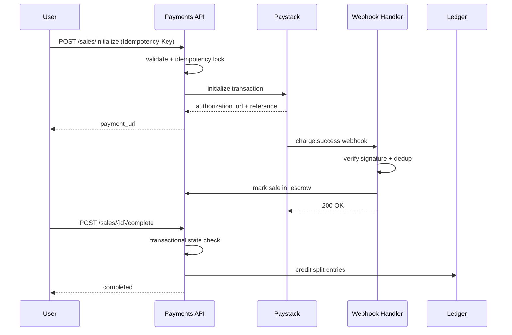
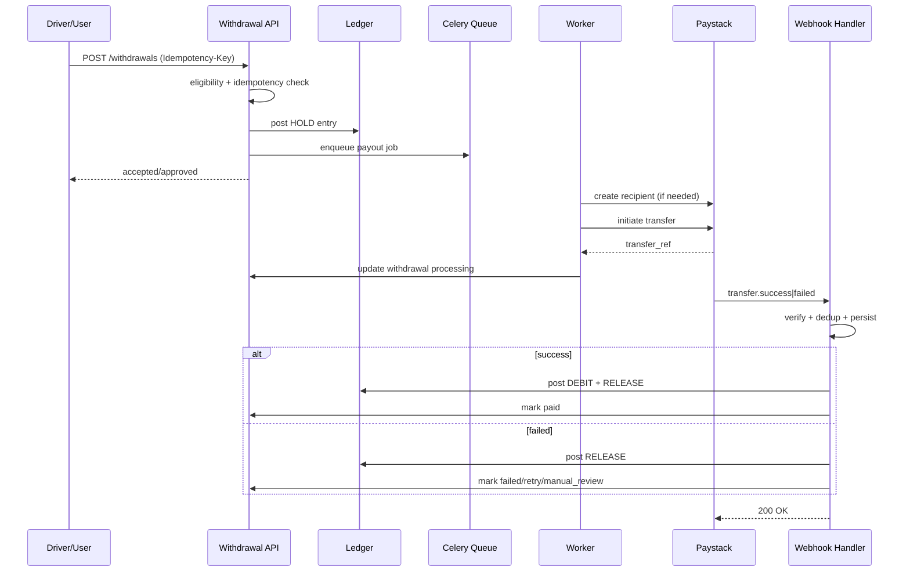
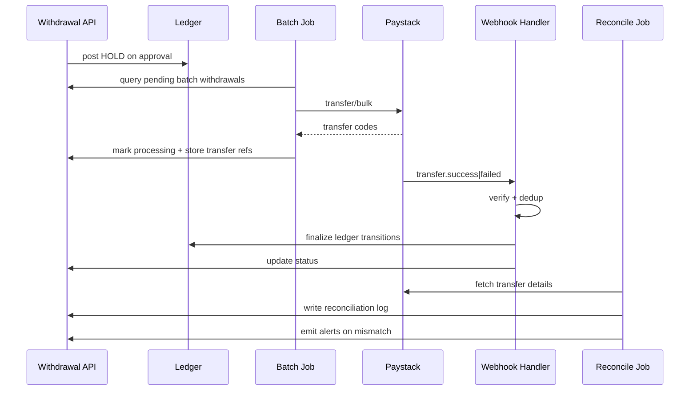
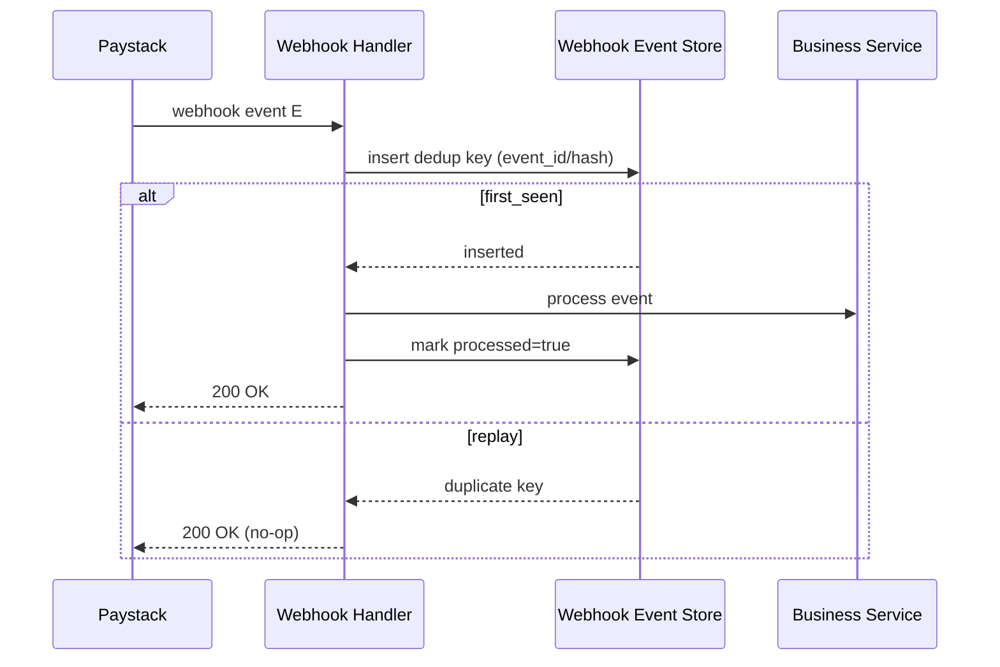

# Sequence Diagrams

## 1) Sale Payment to Settlement

```mermaid
sequenceDiagram
    participant U as User
    participant API as Payments API
    participant PS as Paystack
    participant WH as Webhook Handler
    participant L as Ledger

    U->>API: POST /sales/initialize (Idempotency-Key)
    API->>API: validate + idempotency lock
    API->>PS: initialize transaction
    PS-->>API: authorization_url + reference
    API-->>U: payment_url

    PS->>WH: charge.success webhook
    WH->>WH: verify signature + dedup
    WH->>API: mark sale in_escrow
    WH-->>PS: 200 OK

    U->>API: POST /sales/{id}/complete
    API->>API: transactional state check
    API->>L: credit split entries
    API-->>U: completed
```

## 2) Withdrawal (Realtime Strategy)

```mermaid
sequenceDiagram
    participant D as Driver/User
    participant API as Withdrawal API
    participant L as Ledger
    participant Q as Celery Queue
    participant W as Worker
    participant PS as Paystack
    participant WH as Webhook Handler

    D->>API: POST /withdrawals (Idempotency-Key)
    API->>API: eligibility + idempotency check
    API->>L: post HOLD entry
    API->>Q: enqueue payout job
    API-->>D: accepted/approved

    W->>PS: create recipient (if needed)
    W->>PS: initiate transfer
    PS-->>W: transfer_ref
    W->>API: update withdrawal processing

    PS->>WH: transfer.success|failed
    WH->>WH: verify + dedup + persist
    alt success
        WH->>L: post DEBIT + RELEASE
        WH->>API: mark paid
    else failed
        WH->>L: post RELEASE
        WH->>API: mark failed/retry/manual_review
    end
    WH-->>PS: 200 OK
```

## 3) Withdrawal (Batch Strategy)

```mermaid
sequenceDiagram
    participant API as Withdrawal API
    participant L as Ledger
    participant B as Batch Job
    participant PS as Paystack
    participant WH as Webhook Handler
    participant R as Reconcile Job

    API->>L: post HOLD on approval
    B->>API: query pending batch withdrawals
    B->>PS: transfer/bulk
    PS-->>B: transfer codes
    B->>API: mark processing + store transfer refs

    PS->>WH: transfer.success|failed
    WH->>WH: verify + dedup
    WH->>L: finalize ledger transitions
    WH->>API: update status

    R->>PS: fetch transfer details
    R->>API: write reconciliation log
    R->>API: emit alerts on mismatch
```

## 4) Webhook Replay Protection

```mermaid
sequenceDiagram
    participant PS as Paystack
    participant WH as Webhook Handler
    participant DB as Webhook Event Store
    participant S as Business Service

    PS->>WH: webhook event E
    WH->>DB: insert dedup key (event_id/hash)
    alt first_seen
        DB-->>WH: inserted
        WH->>S: process event
        WH->>DB: mark processed=true
        WH-->>PS: 200 OK
    else replay
        DB-->>WH: duplicate key
        WH-->>PS: 200 OK (no-op)
    end
```
